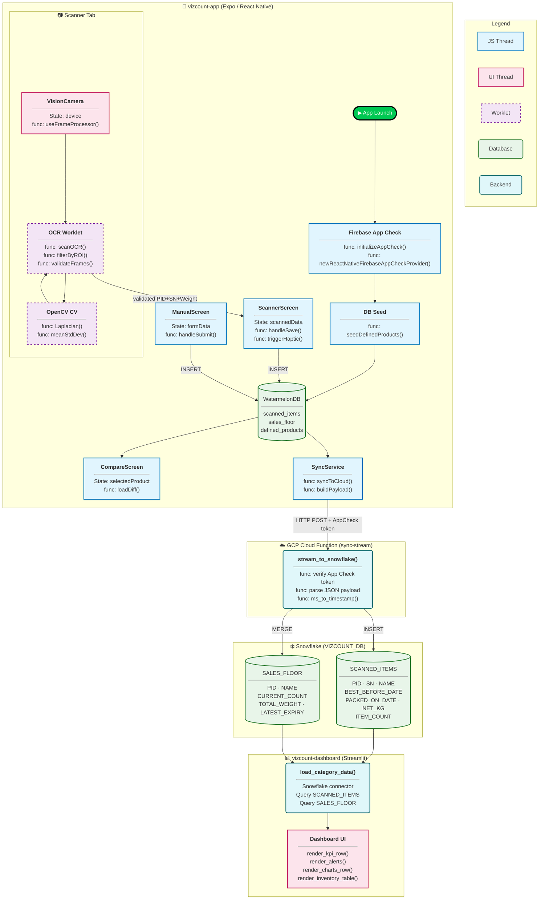
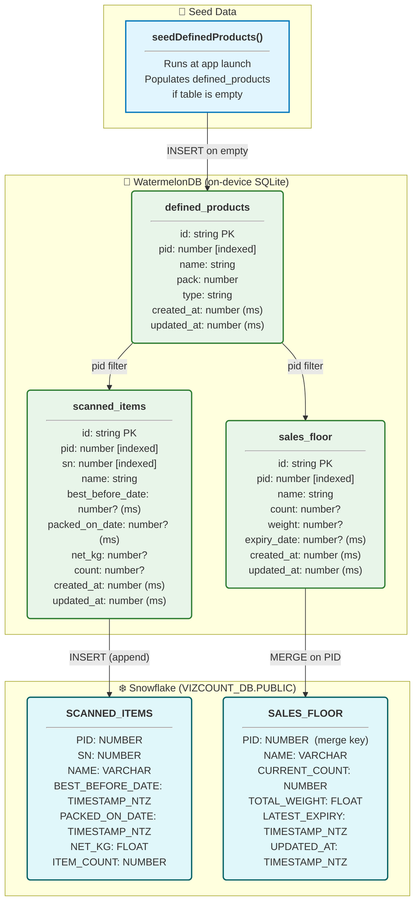

# VizCount 🥩

**VizCount** is a full-stack inventory intelligence system for meat department operations. Staff scan cooler stock with a mobile app, data is synced to Snowflake via a cloud function, and managers review live KPIs on a web dashboard.

---

## Tech Stack

| Layer | Technology |
|---|---|
| Mobile App | Expo / React Native, Vision Camera v4, WatermelonDB |
| OCR + CV | `react-native-vision-camera-ocr-plus`, `react-native-fast-opencv` |
| Backend Sync | GCP Cloud Functions (Python), Firebase App Check |
| Data Warehouse | Snowflake (`VIZCOUNT_DB`) |
| Dashboard | Streamlit (Python), Snowflake connector |

---

## Project Structure

```
VizCount/
├── vizcount-app/          # Expo React Native mobile app
│   ├── app/(tabs)/        # Screens: Scanner, Manual, Compare, Expiry
│   ├── components/        # Shared UI components
│   ├── db/                # WatermelonDB schema, models, seed
│   └── services/          # API / sync service
├── vizcount-dashboard/    # Streamlit analytics dashboard
│   ├── components/        # Metrics, charts, alerts, sidebar, table
│   ├── data/              # Snowflake data loader
│   └── config/            # Page settings
└── backend/
    └── sync-stream/       # GCP Cloud Function: WatermelonDB → Snowflake
```

---

## Diagram 1 — System Architecture

> End-to-end data flow from the device camera through to the management dashboard.



---

## Diagram 2 — App Working Flow

> Runtime execution flow through threads — from launch to scan-save and cloud sync.

```mermaid
graph TD
    classDef jsThread  fill:#e1f5fe,stroke:#0277bd,stroke-width:2px
    classDef uiThread  fill:#fce4ec,stroke:#c2185b,stroke-width:2px
    classDef store     fill:#fff3e0,stroke:#ef6c00,stroke-width:2px,rx:5,ry:5
    classDef db        fill:#e8f5e9,stroke:#2e7d32,stroke-width:2px,rx:5,ry:5
    classDef backend   fill:#e0f7fa,stroke:#006064,stroke-width:2px,rx:5,ry:5
    classDef worklet   fill:#f3e5f5,stroke:#7b1fa2,stroke-width:2px,stroke-dasharray:5 5
    classDef startPoint fill:#00c853,stroke:#000,stroke-width:3px,color:#fff
    classDef checkpoint fill:#ffd600,stroke:#000,stroke-width:2px

    subgraph Legend
        L1["  JS Thread  "]:::jsThread
        L2["  UI Thread  "]:::uiThread
        L3["  Worklet  "]:::worklet
        L4["  Database  "]:::db
        L5["  Cloud  "]:::backend
    end

    A(["▶ App Launched"]):::startPoint
    B["<b>RootLayout</b><hr/>func: initializeAppCheck()<br/>func: useFonts()"]:::jsThread
    C{"Fonts Loaded?"}:::checkpoint
    D["<b>SeedDB</b><hr/>func: seedDefinedProducts()<br/>Insert defined_products if empty"]:::jsThread
    E["<b>DatabaseProvider</b><hr/>WatermelonDB injected<br/>into React tree"]:::jsThread
    F["<b>Tab Navigator</b><hr/>Scanner | Manual | Compare | Expiry"]:::uiThread

    subgraph ScanFlow ["📷 Scan Path (Camera Tab)"]
        G["User opens Scanner Tab"]:::uiThread
        H["<b>VisionCamera</b><hr/>State: isActive=true<br/>useFrameProcessor() registered"]:::uiThread
        I["<b>Frame arrives — Worklet Thread</b><hr/>func: runOpenCV() - blur/reflection check<br/>func: scanOCR() - text extraction<br/>func: filterByROI() - crop to scan zone<br/>func: validateFrames() - 3-frame consensus"]:::worklet
        J{"PID + Weight valid<br/>≥ 3 frames?"}:::checkpoint
        K["<b>JS Thread auto-save</b><hr/>func: handleSave()<br/>INSERT into scanned_items<br/>expo-haptics feedback"]:::jsThread
    end

    subgraph ManualFlow ["✏️ Manual Path"]
        M["User opens Manual Tab"]:::uiThread
        N["<b>ManualScreen</b><hr/>State: pid, sn, name, netKg<br/>ProductPickerModal<br/>DatePickerModal"]:::uiThread
        O["<b>handleSubmit()</b><hr/>Validate form fields<br/>INSERT into sales_floor"]:::jsThread
    end

    subgraph CompareFlow ["📊 Compare Path"]
        P["User opens Compare Tab"]:::uiThread
        Q["<b>CompareScreen</b><hr/>Product dropdown → defined_products<br/>Cooler card ← scanned_items<br/>Floor card ← sales_floor<br/>Diff = Cooler count − Floor count"]:::jsThread
    end

    subgraph SyncFlow ["☁️ Sync to Cloud"]
        R["<b>SyncService</b><hr/>func: syncToCloud()<br/>Collect all local rows<br/>Build JSON payload"]:::jsThread
        S{"App Check<br/>Token valid?"}:::checkpoint
        T["HTTP POST → GCP Cloud Function"]:::backend
        U["<b>stream_to_snowflake()</b><hr/>INSERT scanned_items → Snowflake<br/>MERGE sales_floor → Snowflake"]:::backend
    end

    A --> B --> C
    C -- "No" --> C
    C -- "Yes" --> D --> E --> F
    F --> G --> H --> I --> J
    J -- "No" --> I
    J -- "Yes" --> K
    K --> R
    F --> M --> N --> O --> R
    F --> P --> Q
    R --> S
    S -- "Fail" --> R
    S -- "Pass" --> T --> U
```



---

## Diagram 3 — Database Model

> WatermelonDB (on-device SQLite) schema and its mirror in Snowflake.



---

## Getting Started

### Mobile App

```bash
cd vizcount-app
npm install
npx expo run:android --device   # or run:ios
```

### Dashboard

```bash
cd vizcount-dashboard
python -m venv .venv && source .venv/bin/activate
pip install -r requirements.txt
# copy .streamlit/secrets.toml.example → .streamlit/secrets.toml and fill in credentials
streamlit run app.py
```

### Backend (GCP Cloud Function)

```bash
cd backend/sync-stream
pip install -r requirements.txt
# Deploy with gcloud or Cloud Console
# Set env vars: SNOWFLAKE_USER, SNOWFLAKE_ACCOUNT, SNOWFLAKE_PASS_SECRET
```

---

## Environment Variables

| Var | Used In | Description |
|---|---|---|
| `EXPO_PUBLIC_APP_CHECK_DEBUG_TOKEN` | vizcount-app | Firebase App Check debug token |
| `SNOWFLAKE_USER` | sync-stream (GCP) | Snowflake service account username |
| `SNOWFLAKE_ACCOUNT` | sync-stream (GCP) | Snowflake account identifier |
| `SNOWFLAKE_PASS_SECRET` | sync-stream (GCP) | Snowflake password (injected as env var) |
| Streamlit `secrets.toml` | vizcount-dashboard | Snowflake connection credentials |

---

## License

MIT
