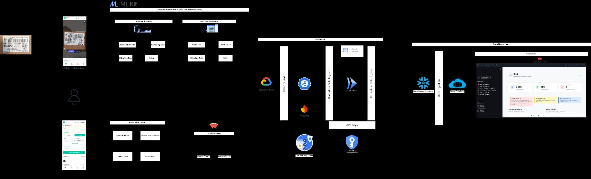
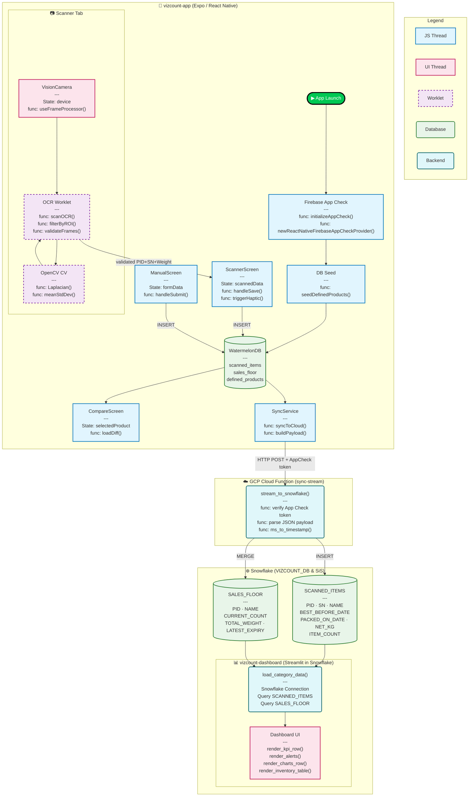
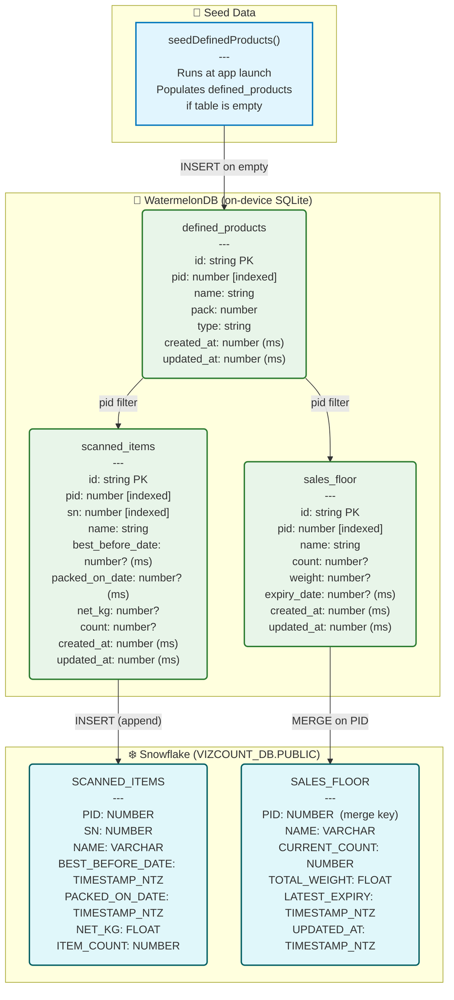

# VizCount 

**VizCount** is a full-stack inventory intelligence system for meat department operations. Staff scan cooler stock with a mobile app, data is synced to Snowflake via a cloud function, and managers review live KPIs on a web dashboard.

---

## Tech Stack

| Layer | Technology |
|---|---|
| Mobile App | Expo / React Native, Vision Camera v4, WatermelonDB |
| OCR + CV | `react-native-vision-camera-ocr-plus`, `react-native-fast-opencv` |
| Backend Sync | GCP Cloud Functions (Python), Firebase App Check |
| Data Warehouse | Snowflake (`VIZCOUNT_DB`) |
| Dashboard | Streamlit in Snowflake (SiS) |

---

## Project Structure

```
VizCount/
├── vizcount-app/          # Expo React Native mobile app
│   ├── app/(tabs)/        # Screens: Scanner, Manual, Compare, Expiry
│   ├── components/        # Shared UI components
│   ├── db/                # WatermelonDB schema, models, seed
│   └── services/          # API / sync service
├── vizcount-dashboard/    # Streamlit analytics dashboard
│   ├── components/        # Metrics, charts, alerts, sidebar, table
│   ├── data/              # Snowflake data loader
│   └── config/            # Page settings
└── backend/
    └── sync-stream/       # GCP Cloud Function: WatermelonDB → Snowflake
```

---

## OCR Pipeline — 10-Stage Frame Processor

> Runs inside a Vision Camera `useFrameProcessor` worklet at ~3 FPS. Stages 1–7 execute on the **Worklet thread**; Stages 7b–10 cross to the **JS thread** via `useRunOnJS`.

```
Frame in
  │
  ▼ [Worklet]
Stage 1 ─ Throttle Gate ──────── skip if < 300 ms since last OCR
Stage 2 ─ Quality Gate ────────── OpenCV Laplacian blur variance + brightness
           │ blur < 80 → "Hold steady"
           │ brightness > 220 → "Glare detected"
           └ brightness < 40  → "Too dark"
Stage 3 ─ MLKit OCR ───────────── scanText(frame) → raw blocks
Stage 4 ─ ROI Spatial Filter ──── per-line centre mapped to screen coords
           confidence < 0.8 rejected; outside ROI rect rejected
Stage 5 ─ Field Extraction ─────── regex on each valid line independently
           PID  : explicit "PID: 12345" OR bare 5-9 digit line
           NetKg: "net 6.42kg" / "6.42kg" / "net 14.15Lb" → Lb×0.453592
                  all values normalised to 2 dp before buffering
Stage 6 ─ Temporal Stabilization ─ rolling buffer (max 5) per field
           value stable when it appears ≥ 3/5 times (majority consensus)
Stage 7 ─ Record Combiner ──────── requires stablePID + stableNetKg
           duplicate guard: skip if same PID was just saved
  │
  ▼ [JS Thread via useRunOnJS]
Stage 7a ─ Product Lookup ──────── query defined_products WHERE pid=stablePID
            not found → 🔴 toast "PID not in catalog" + warning haptic
            found     → { name, type, pack } + 🔵 toast "found — reading…"
Stage 7b ─ Smart SN Extraction ─── type-dependent:
            Chicken  → /\b(\d{14})\b/ near "HU" marker
            Beef/Pork→ /S\/N\s*(\d{12})/i or bare 12-digit
            Other    → AUTO-{timestamp}
Stage 7c ─ Date Parsing ────────── scans all ROI lines for dates:
            DD/MM/YY · YYYY-MM-DD · DD-MMM-YY · YYYYMON DD (Cargill)
            2 dates found → smaller=packedOnDate, larger=bestBeforeDate
Stage 7d ─ Duplicate SN Check ──── query scanned_items WHERE sn=parsedSN
            exists → 🟡 toast "Already counted"
Stage 8  ─ Save ────────────────── INSERT into scanned_items
            { pid, name, netKg, sn, count=pack, bestBeforeDate, packedOnDate }
Stage 9  ─ Scan Lock ───────────── 1.5 s cooldown, clears all field buffers
Stage 10 ─ User Feedback ───────── 🟢 toast "Recorded" + success haptic
                                    green ROI border flash
```

### Product Type → SN Rules

| Type | Pattern | Length | Notes |
|---|---|---|---|
| Chicken | `/\b(\d{14})\b/` | 14 digits | Validated near `HU` marker |
| Beef / Pork | `/S\/N\s*(\d{12})/i` → bare `/\b(\d{12})\b/` | 12 digits | `S/N` explicit prefix first |
| Seafood / Halal / Other | `AUTO-{timestamp}` | — | No known format yet |

### Scan Toast States

| State | Colour | Trigger |
|---|---|---|
| `info` – reading | Sky blue | PID found in catalog |
| `success` – recorded | Emerald | Item saved to WatermelonDB |
| `warning` – duplicate | Amber | SN already in `scanned_items` |
| `error` – unknown | Red | PID not in `defined_products` |

---

## Diagram 1 — System Architecture

> End-to-end data flow from the device camera through to the management dashboard.
>
> 


```mermaid
graph TD
    classDef jsThread  fill:#e1f5fe,stroke:#0277bd,stroke-width:2px
    classDef uiThread  fill:#fce4ec,stroke:#c2185b,stroke-width:2px
    classDef store     fill:#fff3e0,stroke:#ef6c00,stroke-width:2px,rx:5,ry:5
    classDef db        fill:#e8f5e9,stroke:#2e7d32,stroke-width:2px,rx:5,ry:5
    classDef backend   fill:#e0f7fa,stroke:#006064,stroke-width:2px,rx:5,ry:5
    classDef worklet   fill:#f3e5f5,stroke:#7b1fa2,stroke-width:2px,stroke-dasharray:5 5
    classDef startPoint fill:#00c853,stroke:#000,stroke-width:3px,color:#fff
    classDef checkpoint fill:#ffd600,stroke:#000,stroke-width:2px

    subgraph Legend
        L1["  JS Thread  "]:::jsThread
        L2["  UI Thread  "]:::uiThread
        L3["  Worklet  "]:::worklet
        L4["  Database  "]:::db
        L5["  Backend  "]:::backend
    end

    subgraph Mobile ["📱 vizcount-app  (Expo / React Native)"]
        START(["▶ App Launch"]):::startPoint
        AppCheck["Firebase App Check<br/>---<br/>func: initializeAppCheck()<br/>func: newReactNativeFirebaseAppCheckProvider()"]:::jsThread
        Seed["DB Seed<br/>---<br/>func: seedDefinedProducts()"]:::jsThread
        WDB[("WatermelonDB<br/>---<br/>scanned_items<br/>sales_floor<br/>defined_products")]:::db

        subgraph Scanner ["📷 Scanner Tab"]
            Cam["VisionCamera<br/>---<br/>State: device<br/>func: useFrameProcessor()"]:::uiThread
            OCR["OCR Worklet<br/>---<br/>func: scanOCR()<br/>func: filterByROI()<br/>func: validateFrames()"]:::worklet
            OpenCV["OpenCV CV<br/>---<br/>func: Laplacian()<br/>func: meanStdDev()"]:::worklet
        end

        ScannerScreen["ScannerScreen<br/>---<br/>State: scannedData<br/>func: handleSave()<br/>func: triggerHaptic()"]:::jsThread
        ManualScreen["ManualScreen<br/>---<br/>State: formData<br/>func: handleSubmit()"]:::jsThread
        CompareScreen["CompareScreen<br/>---<br/>State: selectedProduct<br/>func: loadDiff()"]:::jsThread
        SyncService["SyncService<br/>---<br/>func: syncToCloud()<br/>func: buildPayload()"]:::jsThread
    end

    subgraph Backend ["☁️ GCP Cloud Function  (sync-stream)"]
        CF["stream_to_snowflake()<br/>---<br/>func: verify App Check token<br/>func: parse JSON payload<br/>func: ms_to_timestamp()"]:::backend
    end

    subgraph DW ["❄️ Snowflake  (VIZCOUNT_DB & SiS)"]
        SF_SI[("SCANNED_ITEMS<br/>---<br/>PID · SN · NAME<br/>BEST_BEFORE_DATE<br/>PACKED_ON_DATE · NET_KG<br/>ITEM_COUNT")]:::db
        SF_SF[("SALES_FLOOR<br/>---<br/>PID · NAME<br/>CURRENT_COUNT<br/>TOTAL_WEIGHT · LATEST_EXPIRY")]:::db
        
        subgraph Dashboard ["📊 vizcount-dashboard  (Streamlit in Snowflake)"]
            Loader["load_category_data()<br/>---<br/>Snowflake Connection<br/>Query SCANNED_ITEMS<br/>Query SALES_FLOOR"]:::backend
            UI_Dash["Dashboard UI<br/>---<br/>render_kpi_row()<br/>render_alerts()<br/>render_charts_row()<br/>render_inventory_table()"]:::uiThread
        end
    end

    START --> AppCheck
    AppCheck --> Seed
    Seed --> WDB
    Cam --> OCR
    OCR --> OpenCV
    OpenCV --> OCR
    OCR -- "validated PID+SN+Weight" --> ScannerScreen
    ScannerScreen -- "INSERT" --> WDB
    ManualScreen -- "INSERT" --> WDB
    WDB --> CompareScreen
    WDB --> SyncService
    SyncService -- "HTTP POST + AppCheck token" --> CF
    CF -- "INSERT" --> SF_SI
    CF -- "MERGE" --> SF_SF
    SF_SI --> Loader
    SF_SF --> Loader
    Loader --> UI_Dash
```

---

## Diagram 2 — App Working Flow

> Runtime execution flow through threads — from launch to scan-save and cloud sync.


```mermaid
graph TD
    classDef jsThread  fill:#e1f5fe,stroke:#0277bd,stroke-width:2px
    classDef uiThread  fill:#fce4ec,stroke:#c2185b,stroke-width:2px
    classDef store     fill:#fff3e0,stroke:#ef6c00,stroke-width:2px,rx:5,ry:5
    classDef db        fill:#e8f5e9,stroke:#2e7d32,stroke-width:2px,rx:5,ry:5
    classDef backend   fill:#e0f7fa,stroke:#006064,stroke-width:2px,rx:5,ry:5
    classDef worklet   fill:#f3e5f5,stroke:#7b1fa2,stroke-width:2px,stroke-dasharray:5 5
    classDef startPoint fill:#00c853,stroke:#000,stroke-width:3px,color:#fff
    classDef checkpoint fill:#ffd600,stroke:#000,stroke-width:2px

    subgraph Legend
        L1["  JS Thread  "]:::jsThread
        L2["  UI Thread  "]:::uiThread
        L3["  Worklet  "]:::worklet
        L4["  Database  "]:::db
        L5["  Cloud  "]:::backend
    end

    A(["▶ App Launched"]):::startPoint
    B["RootLayout<br/>---<br/>func: initializeAppCheck()<br/>func: useFonts()"]:::jsThread
    C{"Fonts Loaded?"}:::checkpoint
    D["SeedDB<br/>---<br/>func: seedDefinedProducts()<br/>Insert defined_products if empty"]:::jsThread
    E["DatabaseProvider<br/>---<br/>WatermelonDB injected<br/>into React tree"]:::jsThread
    F["Tab Navigator<br/>---<br/>Scanner | Manual | Compare | Expiry"]:::uiThread

    subgraph ScanFlow ["📷 Scan Path (Camera Tab)"]
        G["User opens Scanner Tab"]:::uiThread
        H["VisionCamera<br/>---<br/>State: isActive=true<br/>useFrameProcessor() registered"]:::uiThread
        I["Frame arrives — Worklet Thread<br/>---<br/>func: runOpenCV() - blur/reflection check<br/>func: scanOCR() - text extraction<br/>func: filterByROI() - crop to scan zone<br/>func: validateFrames() - 3-frame consensus"]:::worklet
        J{"PID + Weight valid<br/>≥ 3 frames?"}:::checkpoint
        K["JS Thread auto-save<br/>---<br/>func: handleSave()<br/>INSERT into scanned_items<br/>expo-haptics feedback"]:::jsThread
    end

    subgraph ManualFlow ["✏️ Manual Path"]
        M["User opens Manual Tab"]:::uiThread
        N["ManualScreen<br/>---<br/>State: pid, sn, name, netKg<br/>ProductPickerModal<br/>DatePickerModal"]:::uiThread
        O["handleSubmit()<br/>---<br/>Validate form fields<br/>INSERT into sales_floor"]:::jsThread
    end

    subgraph CompareFlow ["📊 Compare Path"]
        P["User opens Compare Tab"]:::uiThread
        Q["CompareScreen<br/>---<br/>Product dropdown → defined_products<br/>Cooler card ← scanned_items<br/>Floor card ← sales_floor<br/>Diff = Cooler count − Floor count"]:::jsThread
    end

    subgraph SyncFlow ["☁️ Sync to Cloud"]
        R["SyncService<br/>---<br/>func: syncToCloud()<br/>Collect all local rows<br/>Build JSON payload"]:::jsThread
        S{"App Check<br/>Token valid?"}:::checkpoint
        T["HTTP POST → GCP Cloud Function"]:::backend
        U["stream_to_snowflake()<br/>---<br/>INSERT scanned_items → Snowflake<br/>MERGE sales_floor → Snowflake"]:::backend
    end

    A --> B --> C
    C -- "No" --> C
    C -- "Yes" --> D --> E --> F
    F --> G --> H --> I --> J
    J -- "No" --> I
    J -- "Yes" --> K
    K --> R
    F --> M --> N --> O --> R
    F --> P --> Q
    R --> S
    S -- "Fail" --> R
    S -- "Pass" --> T --> U
```

---

## Diagram 3 — Database Model

> WatermelonDB (on-device SQLite) schema and its mirror in Snowflake.


```mermaid
graph TD
    classDef jsThread  fill:#e1f5fe,stroke:#0277bd,stroke-width:2px
    classDef uiThread  fill:#fce4ec,stroke:#c2185b,stroke-width:2px
    classDef db        fill:#e8f5e9,stroke:#2e7d32,stroke-width:2px,rx:5,ry:5
    classDef backend   fill:#e0f7fa,stroke:#006064,stroke-width:2px,rx:5,ry:5
    classDef startPoint fill:#00c853,stroke:#000,stroke-width:3px,color:#fff
    classDef checkpoint fill:#ffd600,stroke:#000,stroke-width:2px

    subgraph Local ["📱 WatermelonDB  (on-device SQLite)"]
        DP["defined_products<br/>---<br/>id: string PK<br/>pid: number [indexed]<br/>name: string<br/>pack: number<br/>type: string<br/>created_at: number (ms)<br/>updated_at: number (ms)"]:::db

        SI["scanned_items<br/>---<br/>id: string PK<br/>pid: number [indexed]<br/>sn: number [indexed]<br/>name: string<br/>best_before_date: number? (ms)<br/>packed_on_date: number? (ms)<br/>net_kg: number?<br/>count: number?<br/>created_at: number (ms)<br/>updated_at: number (ms)"]:::db

        SF["sales_floor<br/>---<br/>id: string PK<br/>pid: number [indexed]<br/>name: string<br/>count: number?<br/>weight: number?<br/>expiry_date: number? (ms)<br/>created_at: number (ms)<br/>updated_at: number (ms)"]:::db
    end

    subgraph Cloud ["❄️ Snowflake  (VIZCOUNT_DB.PUBLIC)"]
        SN_SI["SCANNED_ITEMS<br/>---<br/>PID: NUMBER<br/>SN: NUMBER<br/>NAME: VARCHAR<br/>BEST_BEFORE_DATE: TIMESTAMP_NTZ<br/>PACKED_ON_DATE: TIMESTAMP_NTZ<br/>NET_KG: FLOAT<br/>ITEM_COUNT: NUMBER"]:::backend

        SN_SF["SALES_FLOOR<br/>---<br/>PID: NUMBER  (merge key)<br/>NAME: VARCHAR<br/>CURRENT_COUNT: NUMBER<br/>TOTAL_WEIGHT: FLOAT<br/>LATEST_EXPIRY: TIMESTAMP_NTZ<br/>UPDATED_AT: TIMESTAMP_NTZ"]:::backend
    end

    subgraph Seed ["🌱 Seed Data"]
        SEED["seedDefinedProducts()<br/>---<br/>Runs at app launch<br/>Populates defined_products<br/>if table is empty"]:::jsThread
    end

    SEED -- "INSERT on empty" --> DP
    DP -- "pid filter" --> SI
    DP -- "pid filter" --> SF
    SI -- "INSERT (append)" --> SN_SI
    SF -- "MERGE on PID" --> SN_SF
```

---

## Getting Started

### Mobile App

```bash
cd vizcount-app
npm install
npx expo run:android --device   # or run:ios
```

### Dashboard (Streamlit in Snowflake)

The dashboard is deployed directly into Snowflake using Streamlit in Snowflake (SiS), configured via `snowflake.yml`.

```bash
cd vizcount-dashboard
python -m venv .venv && source .venv/bin/activate

# Install dependencies for local development
pip install -r requirements.txt

# To run locally (requires .streamlit/secrets.toml)
streamlit run app.py

# To deploy to Snowflake (SiS) via Snowflake CLI:
snow streamlit deploy
```

### Backend (GCP Cloud Function)

```bash
cd backend/sync-stream
pip install -r requirements.txt
# Deploy with gcloud or Cloud Console
# Set env vars: SNOWFLAKE_USER, SNOWFLAKE_ACCOUNT, SNOWFLAKE_PASS_SECRET
```

---

## Environment Variables

| Var | Used In | Description |
|---|---|---|
| `EXPO_PUBLIC_APP_CHECK_DEBUG_TOKEN` | vizcount-app | Firebase App Check debug token |
| `SNOWFLAKE_USER` | sync-stream (GCP) | Snowflake service account username |
| `SNOWFLAKE_ACCOUNT` | sync-stream (GCP) | Snowflake account identifier |
| `SNOWFLAKE_PASS_SECRET` | sync-stream (GCP) | Snowflake password (injected as env var) |
| Streamlit `secrets.toml` | vizcount-dashboard | Snowflake connection credentials |

---

## License

MIT
